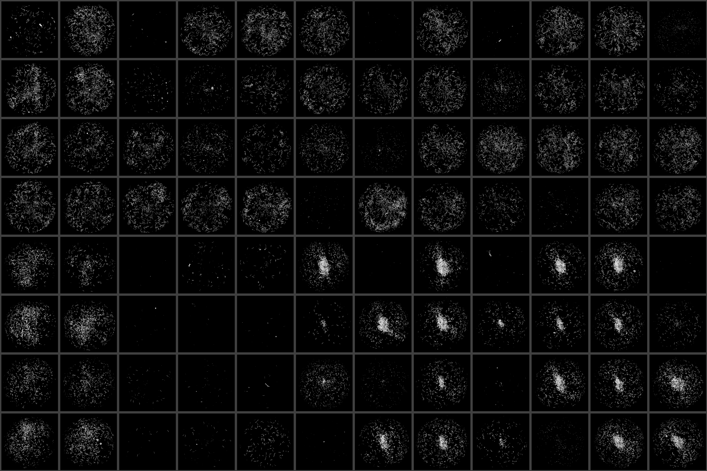

   
   
   
   
   
   

# Overview

This package contains a variety of Python and CellProfiler pipelines used for the analysis of worm imaging data. Some of these are specific to Zamanian lab experimental pipelines, but many of the modules should be robust to a diversity of species and experimental procedures.

Experimental protocols used to generate images that are compatible with wrmXpress can be found in the associated manuscripts and preprints:

- [wrmXpress manuscript](https://doi.org/10.1371/journal.pntd.0010937)
    Contains all the wrmXpress details. See this manuscript for an explanation of modules and pipelines included.
- [Multivariate screening preprint](https://doi.org/10.1101/2022.07.25.501423)
    Includes comprehensive protocols for microfilariae imaging (motility and viability) and adult filaria imaging (motility). Detailed step-by-step procedures can be found at Protocol Exchange for the [bivariate high-content mf screen](https://doi.org/10.21203/rs.3.pex-1916/v1) and the [multivarite adult screen](https://doi.org/10.21203/rs.3.pex-1918/v1).
- [*C. elegans* feeding preprint](https://doi.org/10.1101/2022.08.31.506057)
    Includes details on the development and validation of a feeding protocol using fluorescent stains. Detailed step-by-step procedures for parts of this assay can be found [here](https://doi.org/10.21203/rs.3.pex-2018/v1).

# Installation and usage

The Zamanian Lab run all analyses on a node at the [Center for High-Throughput Computing at UW-Madison](https://chtc.cs.wisc.edu). A Docker recipe containing all the dependendenies can be found in our [Docker GitHub repo](https://github.com/zamanianlab/Docker/tree/main/chtc-wrmxpress), and a pre-compiled image can be found at [DockerHub](https://hub.docker.com/repository/docker/zamanianlab/chtc-wrmxpress). A Conda environment file has also been provided at `local_env/conda_env.yml`, though this may need modification based on the user's processor (e.g., Apple vs Intel).

## Running wrmXpress using a conda environment (local)

1. Use the conda environment file provided at `local_env/conda_env.yml` as a guide for creating a custom environment. **Note**: We have used multiple different conda environments depending on machine architecture. The one provided here should be used as a guide and shows the minimum version numbers.
2. Activate the conda environment.
3. Create a directory where all the wrmXpress operations will take place.
4. In a terminal, set this directory as your home directory: `export HOME=$PWD`. **Note**: Your `$HOME` environmental variable will reset as soon as this terminal is closed, and it will not extrapolate to other terminal tabs/windows.
5. In this new home directory, make `input`, `output`, `metadata`, and `work` directories.
6. Clone the wrmXpress repository from GitHub in the same folder.
7. Transfer the imaging data to `input`. If using a directory of images from wells of a multi-well plate, ensure the image directories are structured in the same was as the example datasets at this Zenodo repository: .
8. Transfer the metadata to `metadata`. A given experiment can have any amount of metadata CSVs, and each CSV should contain a single piece of metadata (i.e., strain.csv, species.csv, treatment.csv, conc.csv, etc.). CSVs should be structured to have the same shape as the multi-well plate (that is, A01 should be the top-left cell).
9. Use and edit the provided YAML file `local_env/parameters_template.yml`) to configure the run. The file should have the same name as the plate directory in `input`.
10. Run the following command from the new home directory: `python wrmXpress/wrapper.py {plate}.yml {plate}` where `{plate}` is the name of the directory that contains the data in `input`.

## Running wrmXpress in a Docker container (local or remote)

1. If running locally, use the Docker desktop app to access the [pre-compiled docker image](https://hub.docker.com/repository/docker/zamanianlab/chtc-wrmxpress). If running on a remote server, consult with the server administrator for using Docker images.
2. In a Docker image, we recommend scripting the process described above. The [Zamanian Lab's Condor-based Bash script](https://github.com/zamanianlab/chtc-submit/blob/main/imgproc/wrmXpress.sh) can be consulted. The script should include the following:
   1. Make `input`, `metadata`, `work`, and `output`, directories in the home directory of the image.
   2. Transfer imaging data (usually stored on a different remote server) to `input/` (see the above notes about structuring the input directory).
   3. Transfer metadata to `metadata` (see the above notes about structuring the metadata CSVs).
   4. Transfer the YAML file to the home directory of the image.
   5. Run the program.

If using a CellProfiler pipeline that implements Cellpose for *C. elegans* segementation, training of a custom model may be required. Follow the instructions [here](cellpose_training/README.md) to train a model on custom images.

For testing, example data for each module/pipline is provided here: .

# Structure

Pipeline parameters are provided in a YAML file (a template with all the fields and options can be found at `local_env/parameters_template.yml`). Parameters are organized within the following headings:

### Instrument settings

**Imaging mode** - Either a single well or multiple wells in each image.

**File structure** - A raw, uncompressed avi (typically associated with multi-well imaging) or the opinionated structure used by the ImageXpress.

**Number of rows and columns per image** - If performing multi-well imaging, include the number of rows/columns in each image. Set both to 1 if mode is single-well.

**Multi-well detection mode** - If performing multi-well imaging, choose the method for detecting wells. `auto` works for cropped videos of 24-well plates; use `grid` for other formats.

### Worm information

**Species** - Supported worm species are *Caenorhabditis elegans*, *Brugia malayi* (or other filarids), and *Schistosoma mansoni*.

**Stages** - Triggers different parameters for the motility and segmentation modules.

### Module selection

**Modules** contains a key for each possible module, including CellProfiler. Modules are invoked by setting the value of `run` to `True`; additional module-specific parameters may apply.

### Run-time settings

**Wells** - Either `All` or a list of wells (each well on a new line, initiated with a hyphen)

**Directories**- Full paths of the `input/`, `output/`, and `work/` directories. If using a Docker image, each can be in the root directory.

# Modules

Please see the [manuscript](https://doi.org/10.1371/journal.pntd.0010937) for a more thorough description of each module.

## Python modules

### motility

A Python implementation of CV2's dense flow algorithm. Requires video input and supports `imagexpress` or `avi` modalities. Thumbnails of flow output are generated by `dx`. If using `multi-well`, `auto` works for videos of 24-well plates cropped to only include the plate; otherwise use `grid`.

 
 

### convert

Converts the default ImageXpress directory structure (images grouped by time point) into a structure that allows for video generation (grouped by well). Automatically invoked when using the motility module. `save_video` can be set to true to save the directory structure to `output`, and `rescale_multiplier` can be set to any float in order to shrink the images (for smaller video sizes).

### segment

Segments worms using a combination of Sobel and Gaussian filters. Has been tested with microfilaria, nematode larvae and adults, and schistosome adults. Can be run on multiple wavelengths and with multi-site images. Thumbnails of segmented worms are generated by `dx`.

 
 

### fecundity

Segments released microfilariae or eggs, depending on species. Has been tested with *Brugia* spp. and *Schistosoma* spp. If using schistosomes, adults do not need to be removed from the well prior to imaging.

 
 

### dx

Generates a plate-shaped thumbnail of each wavelength, as well as diagnostic images from certain modules.

 
 
 
 
 

## CellProfiler pipelines

### mf_celltox

Measures dead microfilaria via fluorescent staining. Compatible with multi-site images. Untested for other worms/stages, but is likely to work out-of-the-box.

### feeding

Measures fluorescence in two channels. Specifically used for *C. elegans* feeding assays, but likely to work with slight modification for any *C. elegans* assay that seeks to measure worm fluorescence in multiple channels.

 

### wormsize

Generic pipeline for measuring the size of worms. Has been tested with mixed stages of *C. elegans*; may work with parasites. Incorporates the worm untangling and straightening algorithms from the [Worm Toolbox](https://doi.org/10.1038/nmeth.1984).

 
 
 
 

### wormsize_trans

Implementation of `wormsize` that also measures worm fluorescence in a single wavelength. Useful for filtering for transgenic worms containing a fluorescent marker.

### wormsize_intensity

Implementation of `wormsize` that also measures intensity features, which may be helpful for filtering non-worms.

### wormsize_intensity_cellpose

Implementation of `wormsize_intensity` that uses [Cellpose](https://github.com/MouseLand/cellpose) and a pre-trained model for *C. elegans* segmentation.

# Issues

Please use the provided issue template when submitting a bug report.
