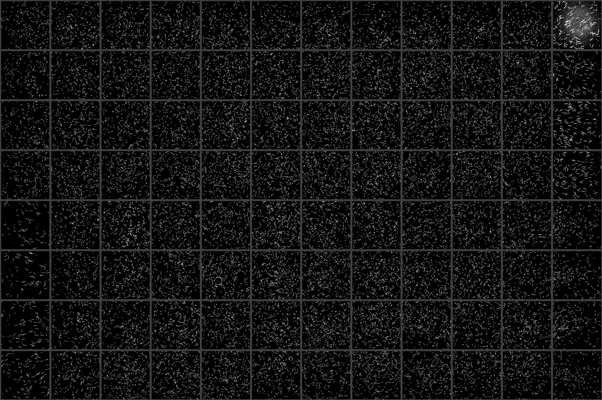
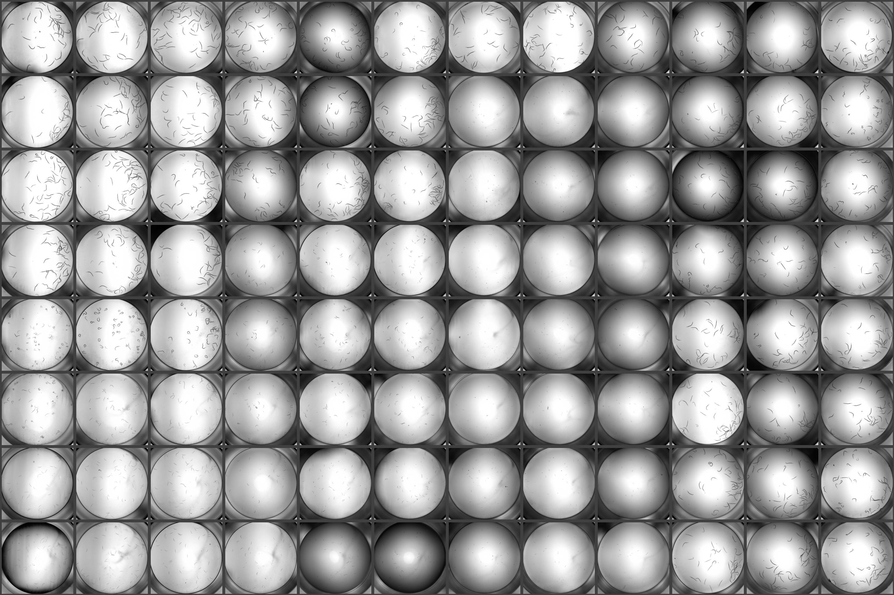
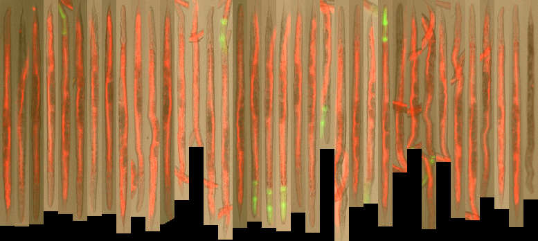

   
   
   
   
   
   
   

# Overview

This package contains a variety of Python and CellProfiler pipelines used for the analysis of worm imaging data. Some of these are specific to Zamanian lab experimental pipelines, but many of the modules should be robust to a diversity of species and experimental procedures.

Experimental protocols used to generate images that are compatible with wrmXpress can be found in the associated manuscripts and preprints:

- [wrmXpress preprint](https://doi.org/10.1101/2022.05.18.492482)
    Contains all the wrmXpress details. See this preprint for an explanation of modules and pipelines included.
- [Multivariate screening preprint](https://doi.org/10.1101/2022.07.25.501423)
    Includes comprehensive protocols for microfilariae imaging (motility and viability) and adult filaria imaging (motility)
- [*C. elegans* feeding preprint]()
    Includes details on the development and validation of a feeding protocol using fluorescent stains

# Installation, dependencies, and usage

The Zamanian lab run all analyses on a node at the [Center for High-Throughput Computing at UW-Madison](https://chtc.cs.wisc.edu). A Docker imaging containing all the dependendenies can be found in our [Docker GitHub repo](https://github.com/zamanianlab/Docker/tree/main/chtc-imgproc). A conda environment file has also been provided at `local_env/conda_env.yml`.

Activate the Docker/conda environment, clone the repository, update the YAML and run: `python wrmXpress.py {path/to/parameters.yml} {name of plate directory}`

# Structure

Pipeline parameters are provided in a YAML file (a template can be found at `local_env/parameters_template.yml`). Parameters are organized within the following headings:

### Instrument settings

`imaging_mode` - A single well (`single-well`) or mutiple wells (`multi-well`) in each image

`file_structure` - A raw, uncompressed avi (`avi`, typically associated with `multi-well`) or the opinionated structure used by the ImageXpress (`imagexpress`, typically associated with `multi-well`)

`multi-well-row` and `multi-well-col` - If `imaging_mode`: `multi-well`, include the number of rows/columns in each image. Set both to 1 if `single-well`

`multi-well-detection` - If`imaging_mode`: `multi-well`, choose the method for detecting wells. `auto` works for cropped videos of 24-well plates; use `grid` for other formats.

### Worm information

`species` - Supported worm species are *Caenorhabditis elegans* (`Cel`), *Brugia malayi* (or other filarids, `Bma`), and *Schistosoma mansoni* (`Sma`)
`stages` - Triggers different parameters for the motility module; supports microfilariae (`mf`) or adults (`Adults`)

### Module selection

`modules` contains a key for each possible module, including CellProfiler. Modules are invoked by setting the value of `run` to `True`; additional module-specific parameters may apply.

### Run-time settings

`wells` - Either `All` or a list (each field on a new line, initiated with a hyphen) of wells
`directories` - Full paths of the `input/`, `output/`, and `work/` directories. If using a Docker image, each can be in the root directory.

# Modules

Please see the [preprint](https://doi.org/10.1101/2022.05.18.492482) for a more thorough description of each module.

## Python modules

### motility

A Python implementation of CV2's dense flow algorithm. Requires video input and supports `imagexpress` or `avi` modalities. Thumbnails of flow output are generated by `dx`. If using `multi-well`, `auto` works for videos of 24-well plates cropped to only include the plate; otherwise use `grid`.

 

### convert

Converts the default MetaXpress directory structure (images grouped by time point) into a structure that allows for video generation (grouped by well). Automatically invoked when using the motility module. `save_video` can be set to true to save the directory structure to `output`, and `rescale_multiplier` can be set to any float in order to shrink the images (for smaller video sizes).

### segment

Segments worms using a combination of Sobel and Gaussian filters. Has been tested with microfilaria, nematode larvae and adults, and schistosome adults (with some modification). Can be run on multiple wavelengths and with multi-site images. Thumbnails of segmented worms are generated by `dx`.

 
 
 

### dx

Generates a plate-shaped thumbnail of each wavelength, as well as diagnostic images from certain modules.

 
 
 
 
 

## CellProfiler pipelines

### mf_celltox

Measures dead microfilaria via fluorescent staining. Compatible with multi-site images. Untested for other worms/stages, but is likely to work out-of-the-box.

### feeding

Measures fluorescence in two channels. Specifically used for *C. elegans* feeding assays, but likely to work with slight modification for any *C. elegans* assay that seeks to measure worm fluorescence in multiple channels.

 
 
### wormsize

Generic pipeline for measuring the size of worms. Has been tested with mixed stages of *C. elegans*; may work with parasites. Incorporates the worm untangling and straightening algorithms from the [Worm Toolbox](https://doi.org/10.1038/nmeth.1984).

 
 
 
 

### wormsize_trans

Implementation of `wormsize` that also measures worm fluorescence in a single wavelength. Useful for filtering for transgenic worms containing a fluorescent marker.

### wormsize_intensity

Implementation of `wormsize` that also measures intensity features, which may be helpful for filtering non-worms.

# Issues

Please use the provided issue template when submitting a bug report.
