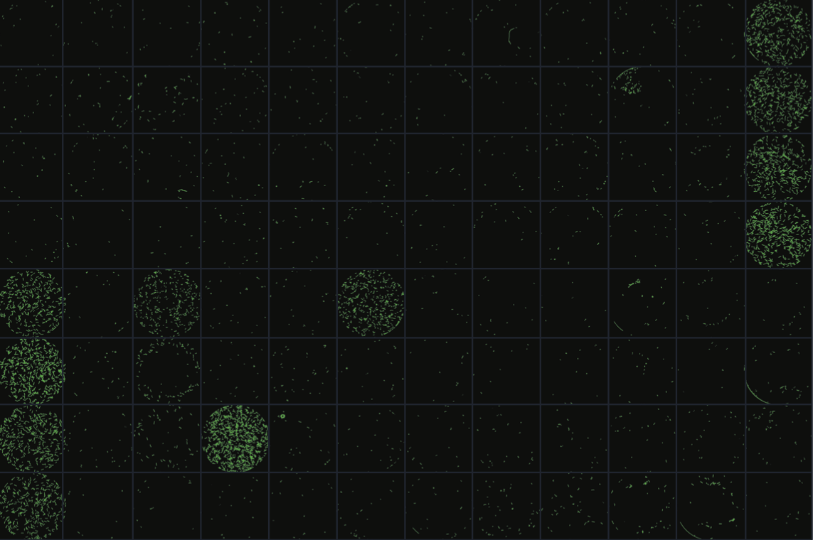
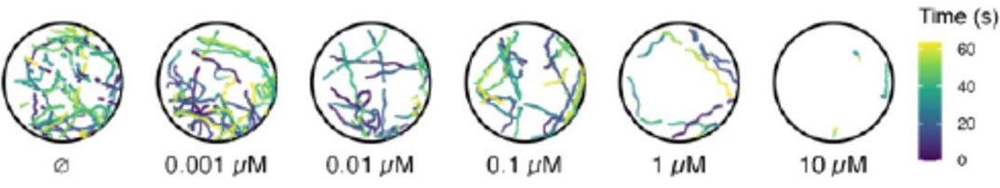

<br>  
<br>  
<br>  
<br>  
<br>  
<br>  

# Overview

This package contains a variety of Python and CellProfiler pipelines used for the analysis of worm imaging data. Some of these are specific to Zamanian lab experimental pipelines, but many of the pipelines should be robust to a diversity of species and experimental procedures.

Experimental protocols used to generate images that are compatible with wrmXpress can be found in the associated manuscripts and preprints:

- [wrmxpress V2.0 preprint](https://doi.org/10.1101/2025.03.14.643077)

- [wrmXpress manuscript](https://doi.org/10.1371/journal.pntd.0010937)

    Contains all the wrmXpress details. See this manuscript for an explanation of pipelines (previously called modules) included.

# Table of Contents
- [Installation and Dependencies](#installation-and-dependencies)
- [Running wrmXpress](#running-wrmxpress)
- [Plate ID Naming Convention](#plate-id-naming-convention)
- [Input Structure](#input-structure)
- [Metadata Structure](#metadata-structure)
- [YAML Structure](#yaml-structure)
- [Pipelines](#pipelines)
    - [Diagnostics](#diagnostics)
    - [Optical Flow](#optical-flow)
    - [Segmentation](#segmentation)
    - [CellProfiler](#cellprofiler)
    - [Tracking](#tracking)
- [Issues](#issues)
- [Additional Information](#additional-information)


# Installation and Dependencies

The Zamanian Lab run all analyses on a node at the [Center for High-Throughput Computing at UW-Madison](https://chtc.cs.wisc.edu). A Docker recipe containing all the dependendenies can be found in our [Docker GitHub repo](https://github.com/zamanianlab/Docker/tree/main/chtc-wrmxpress), and a pre-compiled image can be found at [DockerHub](https://hub.docker.com/repository/docker/zamanianlab/chtc-wrmxpress). Please download and install [Docker Desktop](https://docs.docker.com/desktop/) and pull the latest version of the Docker, currently: `zamanianlab/chtc-wrmxpress: v9`

External dependencies used: 

- `numpy` – used in [diagnostics, optical_flow, segmentation, tracking] pipelines and [image_processing] preprocessing for numerical operations and array handling.
- `pandas` – used in [optical_flow, segmentation] pipelines for reading, writing, and managing CSV files and tabular data.
- `cv2` – used in [diagnostics, optical_flow, segmentation] pipelines and [image_processing] preprocessing for image reading, processing, filtering, and writing.
- `skimage` – used in [segmentation] pipeline for advanced image processing, including filters, edge detection, and measurements.
- `scipy` – used in [optical_flow, segmentation] pipelines for additional image processing functions (e.g., Gaussian filtering).
- `trackpy` – used in [tracking] pipeline for tracking individual objects across video frames.
- `imageio` – used in [tracking] pipeline for reading and writing image files when cv2 is not effective.
- `matplotlib` – used in [tracking] pipeline for plotting visualizations.
- `yaml` – used in [image_processing, utilities] preprocessing for reading and writing YAML configuration files.
- `PIL` – used in [diagnostics, optical_flow] pipelines and [image_processing] preprocessing for reading, writing, and basic manipulation of images.

Python standard library modules:  

- `os` – used in [cellprofiler, diagnostics, segmentation] pipelines and [image_processing, utilities] preprocessing for file/directory operations.
- `shutil` – used in [cellprofiler, segmentation] pipelines and [image_processing] preprocessing for copying/moving files and directories.
- `glob` – used in [cellprofiler, segmentation, tracking] pipelines for pattern-based file searching.
- `time` – used in [cellprofiler, diagnostics, optical_flow, segmentation, tracking] pipelines for timing operations and logging.
- `re` – used in [diagnostics] pipeline and [image_processing, utilities] preprocessing for regular expression matching and filename parsing.
- `pathlib` – used in [cellprofiler, optical_flow, segmentation, tracking] pipelines and [utilities] preprocessing for path management and cross-platform file handling.
- `subprocess` – used in [cellprofiler, segmentation] pipelines for calling external programs.
- `shlex` – used in [cellprofiler, segmentation] pipelines for splitting shell commands safely.
- `tempfile` – used in [cellprofiler, segmentation] to create temporary directories for image processing.


# Running wrmXpress

1. If running locally, use the Docker desktop app to access the [pre-compiled docker image](https://hub.docker.com/repository/docker/zamanianlab/chtc-wrmxpress). If running on a remote server, consult with a server administrator for using Docker images. 

2. Create a directory where all the wrmXpress operations will take place. You may name this home directory whatever you would like. 

3. In this new home directory, make `input`, `output`, `metadata`, and `work` directories.

4. Clone the wrmXpress repository from GitHub in the home directory using this command:

```git clone https://github.com/zamanianlab/wrmXpress.git```

5. Transfer your imaging data to `input`. Ensure the image directories are structured in the same way as shown further below or the example datasets at this Zenodo repository: [](https://doi.org/10.5281/zenodo.7116648). 

6. Transfer any metadata to `metadata`. See further below on how to structure the metadata.

7. Use and edit the provided YAML file, `master.yml` to configure the run and add it to the home directory. The file should have the same name as the plate directory in `input`. Please see further below and in the `master.yml` on how to configure your run. 

8. At this point, your home directory should look like this:
```
[home directory]/
├── input/        # Raw imaging data organized by plate
│   └── {plate}/  # Example: 20250127-p01-ABC
├── metadata/     # Metadata CSVs corresponding to the plates
│   └── {plate}/  # Example: 20250127-p01-ABC
├── work/         # Intermediate results generated during processing
├── output/       # Final analysis results (images, CSVs)
├── wrmXpress/    # Cloned repository containing the code and pipelines
└── {plate}.yml   # YAML configuration file for the plate (same name as the plate directory in input/)

```

9. Open Docker and a terminal window, navigate to your home directory created above, and run this command to mount your home directory. Ensure you are using the most recent version of the Docker:
```
docker run -it -v ${PWD}:/scratch -w /scratch zamanianlab/chtc-wrmxpress:v9 /bin/bash
```

10. Run this command to redefine your home directory as the current working directory:
```
export HOME=$PWD
```

11. Run this command to run your plate: 
```
python /opt/wrmXpress/wrapper.py {plate}.yml {plate}
```

After running wrmXpress, the output folder will contain organized results per pipeline chosen. For example:
```
├── output/       # Final analysis results
│   └── {pipeline}/  # Folder for each selected pipeline
│       ├── cellprofiler/
│       │   ├── {plate_id}.png       # Stitched diagnostic of the plate
│       │   └── img/                 # Folder containing wavelength images
│       ├── optical_flow/
│       │   ├── {plate_id}.png       # Stitched diagnostic of the plate
│       │   └── {plate_id}_tidy.csv  # Motility/flow measurements
│       ├── segmentation/
│       │   ├── {plate_id}.png       # Stitched diagnostic of the plate
│       │   └── {plate_id}_tidy.csv  # Segmentation measurements
│       └── tracking/
│           ├── {plate_id}.png       # Stitched diagnostic of the plate
│           └── {plate_id}_tidy.csv  # Tracking measurements
```

For testing, example data for each pipline is provided here: [](https://doi.org/10.5281/zenodo.7116648).

# Plate ID Naming Convention
Users can use any naming convention they prefer but the YAML configuration file and the plate ID in `input/` and `metadata/` must share the same name. Our lab uses the following naming convention: `YYYYMMDD-p##-XXX` whereby:

    - `YYYYMMDD` → date of experiment  
    - `p##` → plate number of said date
    - `XXX` → researcher initials (does not have to be 3 letters)  

An example of a plate would be `20250127-p01-ABC`. 

Important note: If your plate ID uses an underscore followed by a number, that portion will be cut off. So for instance, `20250127-p01-ABC_123456` will convert to `20250127-p01-ABC`.

# Input Structure

Below are the image types that wrmxpress can currently handle. Please note that wherever you see `{plate}`, it is refering to what you name your plate. 

Structure for an ImageXpress plate (single-well or multi-site images). Our lab uses a high-content imaging machine called the ImageXpress from [Molecular Devices](https://www.moleculardevices.com/products), which automatically strucutres data in this format:
```
{plate}_Plate_unique_identifier/
├── {plate}.HTD     # HTD file associated with the plate
├── TimePoint_1/    # Timepoint for plate (may have multiple timepoints)
│   └── images      # Images labeled by well/site (e.g. 20250127-p01-ABC_A01.TIF)
```

Structure for an AVI video of a plate (multi-well images):
```
{plate}/
├── {plate}.AVI     # Video of plate
```

Structure for a multicamera array (multi-well images). Our lab uses a 6 camera [loopbio](http://loopbio.com/index.html) recording system:
```
{plate}/
├── {plate}.{camera_serial number}/     # May have video from multiple cameras
│   └──  MPEG4 video                    # Video of section of plate
```

# Metadata Structure

A given experiment can have any number of metadata CSVs, and each CSV should contain a single piece of metadata (i.e., strain.csv, species.csv, treatment.csv, concentration.csv, etc.). Values within the CSVs should mirror the same shape as the plate (96 well-plate metadata csv should be 8x12). Metadata will be automatically mapped to analysis results by well. The metadata folder can be left blank if you do not have any, otherwise it can be structured like below:

```
├── metadata/  
│   └── {plate}/  
│       ├── species.csv     
│       ├── treatment.csv
│       ├── concentration.csv
│       ├── other.csv           # You may name and use any kind of metadata
```

# YAML structure

Pipeline parameters are provided and configured through a YAML file. A template with all the fields and options can be found in the main folder as `master.yml`. **Pipelines** contains a key for each possible pipeline. Pipelines are invoked by setting the value of `run` to `True`; additional pipeline-specific parameters may apply. Some options must be uncommented to be run. Pipelines can be run simultaneously but for those that are not needed, set the value of `run` to `False`

# Pipelines 

Please see the [manuscript](https://doi.org/10.1371/journal.pntd.0010937) for a more thorough description of each pipeline previously called "modules".

## Diagnostics

### static_dx


Generates a plate-shaped thumbnail of each wavelength, as well as diagnostic images from certain pipelines.

<br>
<br>
<br>
<br>

### video_dx


Generates a plate-shaped video of each wavelength, where single-well video can be captured as well.

<br>
<br>
<br>
<br>

## Optical Flow


A Python implementation of CV2's dense flow algorithm and calculates the flow magnitude for each well. Requires video input and supports `imagexpress`, `avi`, or `loopbio` (multi-camera array) modalities.

<br>
<br>
<br>
<br>

## Segmentation


Segments worms using [Cellpose](https://github.com/MouseLand/cellpose/blob/main/README.md) or Python's Sobel and Gaussian filters. Custom models can be created via Cellpose for various species and added to pipelines/models/cellpose to use in the segmentation pipeline. Can be run on multiple wavelengths and with multi-site images. Thumbnails of segmented worms are generated by `static_dx`.

<br>
<br>
<br>
<br>

## CellProfiler
Custom models can be created via [CellProfiler](https://github.com/CellProfiler/CellProfiler/blob/main/README.md) for various species and added to pipelines/cellprofiler to use in the CellProfiler pipeline. Below are various custom pipelines for measuring viability and development.  

### mf_celltox



Measures dead microfilaria via fluorescent staining. Compatible with multi-site images. Untested for other worms/stages, but is likely to work out-of-the-box.

<br>
<br>
<br>
<br>

### feeding


Measures fluorescence in two channels. Specifically used for *C. elegans* feeding assays, but likely to work with slight modification for any *C. elegans* assay that seeks to measure worm fluorescence in multiple channels.

<br>
<br>

### wormsize


Generic pipeline for measuring the size of worms. Has been tested with mixed stages of *C. elegans*; may work with parasites. Incorporates the worm untangling and straightening algorithms from the [Worm Toolbox](https://doi.org/10.1038/nmeth.1984).

<br>
<br>
<br>

### wormsize_intensity_cellpose

Implementation of `wormsize_intensity` that uses [Cellpose](https://github.com/MouseLand/cellpose/blob/main/README.md) and a pre-trained model for *C. elegans* segmentation.

## Tracking



Tracks individual worms across timepoints using the Trackpy library. Generates trajectory visualizations and CSV files containing frame-by-frame coordinate data for each worm, enabling quantitative analysis of movement and behavior.

<br>
<br>

# Issues

Please use the provided issue template when submitting a bug report. For other issues or questions about model development, please reach out to the zamanian lab at these emails: mzamanian@wisc.edu or lrnunn@wisc.edu.  

# Additional Information

Supplemental papers: 

- [Multivariate screening preprint](https://doi.org/10.1101/2022.07.25.501423)

    Includes comprehensive protocols for microfilariae imaging (motility and viability) and adult filaria imaging (motility). Detailed step-by-step procedures can be found at Protocol Exchange for the [bivariate high-content mf screen](https://doi.org/10.21203/rs.3.pex-1916/v1) and the [multivarite adult screen](https://doi.org/10.21203/rs.3.pex-1918/v1).
- [*C. elegans* feeding preprint](https://doi.org/10.1101/2022.08.31.506057)

    Includes details on the development and validation of a feeding protocol using fluorescent stains. Detailed step-by-step procedures for parts of this assay can be found [here](https://doi.org/10.21203/rs.3.pex-2018/v1).
